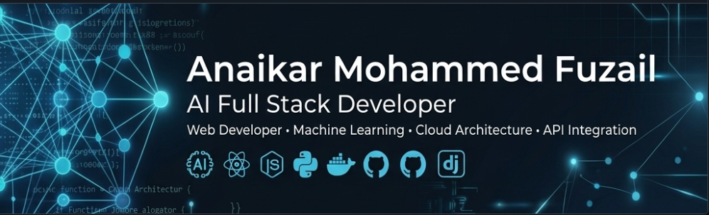

<!--
🤖 Crafted with premium precision and high-end design for Anaikar Mohammed Fuzail.
Designed to stand out to recruiters at Google, Microsoft, Amazon, Zoho, and elite tech companies.
-->

  

 

  <h1>👋 Hello, I'm Anaikar Mohammed Fuzail</h1>
  
  <!-- Typing Animation for Roles -->
  
  
  

    
    
    
  

  <!-- Visitor Counter -->
  

    
  

---

## 📊 Developer Metrics & Analytics

  <table border="0" cellspacing="0" cellpadding="0" style="border-collapse: collapse; border: none; background: transparent;">
    <tr style="border: none; background: transparent;">
      <td valign="top" style="border: none; background: transparent; padding: 0 10px 0 0;">
        
      </td>
      <td valign="top" style="border: none; background: transparent; padding: 0 0 0 10px;">
        
      </td>
    </tr>
  </table>

---

## 🧑‍💻 Professional Profile

I am an aspiring **AI Full Stack Developer** and **Software Engineer** based in Tamil Nadu, India. Specializing in high-performance web systems, backend engineering with **Python/Django**, and modern frontends with **React**, I build intelligent applications that bridge the gap between machine learning models and production-ready web platforms.

- 🔭 **Current Focus**: Designing responsive, AI-infused full-stack platforms and REST APIs.
- 🌱 **Advanced Upskilling**: System Design, Microservices, React State Management, and AI Integration.
- ⚡ **Philosophy**: Clean architectures, modular code, and sub-millisecond database queries lead to exceptional user experiences.

---

## ⚡ Core Technical Expertise

  <table width="100%">
    <tr>
      <td width="50%" valign="top">
        <h3>🚀 Backend & AI Systems</h3>
        <ul>
          <li><b>Python / Django</b>: Building optimized, secure web backends and API integrations.</li>
          <li><b>Database Design</b>: Modeling relational schemas, optimizing indexing, and query performance in MySQL.</li>
          <li><b>AI Integration</b>: Connecting AI models and LLM APIs to web client applications.</li>
        </ul>
      </td>
      <td width="50%" valign="top">
        <h3>🖥️ Frontend & UX</h3>
        <ul>
          <li><b>JavaScript / React</b>: Creating single-page applications with fluid interfaces.</li>
          <li><b>Modern Styling</b>: Building clean, responsive layout architectures with CSS3 and HTML5.</li>
          <li><b>API Integration</b>: Linking backend web services with interactive frontend states.</li>
        </ul>
      </td>
    </tr>
  </table>

---

## 🛠️ Tech Stack & Badges

### 💻 Languages & Frameworks

  
  
  
  

### 🗄️ Database & Design

  
  
  

### 🔧 Tools & Workflow

  
  
  

---

## 📈 Activity & Streaks

  

---

## 📚 Future Growth & Focus Areas

*   **Scalable System Design**: Learning caching strategies (Redis), vertical/horizontal database sharding, and containerization.
*   **AI Full-Stack Systems**: Integrating intelligent features, natural language search, and automated workflows directly into production applications.
*   **Production Deployment**: Gaining expertise in CI/CD pipelines, cloud architectures, and serverless environments.

---

## 🎯 Open Source Goals (2026)

- [ ] Build and launch an open-source AI-integrated tool for Python developers.
- [ ] Active daily contributions to major web engineering repositories.
- [ ] Authoring highly technical blog posts on system optimization and backend development.
- [ ] Collaborating on community projects built on the Django REST Framework.

---

## 📁 Featured Projects

### 🍰 Dreamy Delight Project
*A highly dynamic, end-to-end full stack web application for an artisan bakery brand.*
- **Backend & Database**: Designed relational MySQL schemas, optimized Python/Django database connections, and implemented DRF authentication.
- **Frontend Integration**: Implemented JWT login flow, dynamic food ordering interfaces, and secure Protected Routes in React.
- **Outcome**: A smooth, modern ordering system backed by a rich visual administrative dashboard.

---

## 🐍 Contribution Activity

  <picture>
    <source media="(prefers-color-scheme: dark)" srcset="https://raw.githubusercontent.com/mohammedfuzaila/mohammedfuzaila/output/github-contribution-grid-snake-dark.svg">
    <source media="(prefers-color-scheme: light)" srcset="https://raw.githubusercontent.com/mohammedfuzaila/mohammedfuzaila/output/github-contribution-grid-snake.svg">
    
  </picture>

---

## 🤝 Let's Connect

I am eager to engage with developers, technical recruiters, and engineering leads from **Google, Microsoft, Amazon, Zoho, TCS, Infosys, Wipro, and high-growth startups**. Let's build something exceptional!

  
  

---

  Designed with ❤️ by <b>Anaikar Mohammed Fuzail</b> • © 2026

